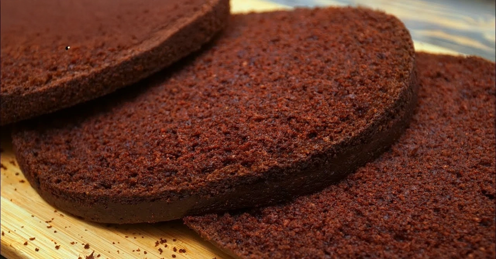

# Scorpus

| | |
| :--- | ---: |
| **Scorpus** is an alternative [ListenBrainz](https://listenbrainz.org) (Last.fm planned for the future) frontend that stores metadata and cover images.<br><br>Includes scrobbles fetching, metadata enrichment, and an interactive [PureScript](https://purescript.org) frontend for exploration of your listening habits.<br><br>[Live instance running here.](https://scrobbler.mtmn.name) |  |

## Documentation

- [Architecture](docs/architecture.md) — Deep dive into the system components, data flow, and FFI usage.
- [DuckDB](docs/duckdb.md) — Schema details, analytical queries, and tools for data exploration.

## Usage

This project uses [just](https://github.com/casey/just) and [Nix](https://nixos.org) for development and deployment.

### Development

```bash
# Enter the development shell (includes PureScript, DuckDB, etc.)
just shell

# Build
just nix build

# Run the binary built by Nix
just nix run
```

### Build

```bash
# Install dependencies
npx spago install

# Build the project
npx spago build

# Run tests
npx spago test

# Bundle the client for the browser
npx spago bundle --module Client --outfile client.js --platform browser
```


### Environment variables

| Variable | Default | Description |
| :--- | :--- | :--- |
| `LISTENBRAINZ_USER` | — | Your ListenBrainz username (required for syncing) |
| `DATABASE_FILE` | `scorpus.db` | Path to the DuckDB database file |
| `PORT` | `8000` | HTTP port to listen on |
| `INITIAL_SYNC` | — | Set to `true` to perform a full historical sync on startup |
| `COVER_CACHE_ENABLED` | `true` | Set to `false` to disable S3 cover art caching |
| `S3_BUCKET` | — | S3 bucket name for cover art caching |
| `S3_REGION` | `us-east-1` | S3 region |
| `AWS_ACCESS_KEY_ID` | — | S3 credentials |
| `AWS_SECRET_ACCESS_KEY` | — | S3 credentials |
| `AWS_ENDPOINT_URL` | — | S3-compatible endpoint (e.g. for MinIO) |
| `AWS_S3_ADDRESSING_STYLE` | — | Set to `path` for path-style S3 URLs |
| `LASTFM_API_KEY` | — | Last.fm API key for cover art fallback |
| `DISCOGS_TOKEN` | — | Discogs token for cover art fallback |
| `BACKUP_ENABLED` | — | Set to `true` to enable periodic local database backups |
| `BACKUP_INTERVAL_HOURS` | `1` | How often to back up the database (in hours) |

Backups are written to a `backup/` directory alongside `DATABASE_FILE`, named `scorpus-<timestamp>.db`.
