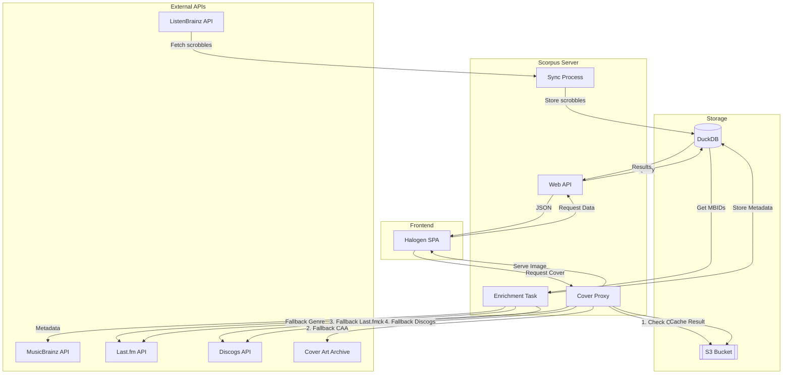

# Scorpus Architecture

Scorpus is a personal music listening history dashboard and analytics service. It synchronizes scrobbles from ListenBrainz and provides a performant web interface for data exploration and statistics.

## System Components

### Web Server
The server is built with PureScript running on Node.js. It handles several core responsibilities:
- **HTTP API**: Serves the frontend, scrobble data (with filtering/pagination), and statistics.
- **ListenBrainz Sync**: A background process that polls the ListenBrainz API every 60 seconds to fetch new scrobbles.
- **Metadata Enrichment**: A background process that identifies scrobbles with missing metadata (genres, labels, release years) and fetches information from MusicBrainz, Last.fm, and Discogs.
- **Cover Art Proxy**: A specialized endpoint that fetches, caches, and serves cover art, utilizing a multi-source fallback strategy (CAA → Last.fm → Discogs).

### Frontend
A Single Page Application (SPA) built with PureScript and the [Halogen](https://github.com/purescript-halogen/purescript-halogen) framework.
- **Real-time Updates**: Periodically refreshes the scrobble list.
- **Filtering & Search**: Supports deep filtering by genre, label, or release year.
- **Responsive UI**: Designed for both desktop and mobile viewing with a "retro-modern" aesthetic.

### Database
Scorpus uses **DuckDB** for its primary data storage.
- **Schema**:
    - `scrobbles`: Stores the core listening history (timestamp, track, artist, album, MBIDs).
    - `release_metadata`: Stores enriched metadata indexed by MusicBrainz Release ID (MBID).
- **Performance**: DuckDB's columnar storage allows for extremely fast analytical queries across large listening histories.

### Storage
Uses an S3-compatible bucket to cache cover art images.
- **Caching Strategy**: Images are fetched once from external APIs and stored in S3 to reduce latency and avoid rate-limiting on external services.

## Data Flow

### Scrobble Synchronization
1. Server triggers sync process.
2. Fetches latest 100 scrobbles from ListenBrainz.
3. Performs a "gap-fill" by paginating backwards if the local database is significantly behind.
4. Stores new scrobbles in the DuckDB `scrobbles` table.

### Metadata Enrichment
1. Background task identifies MBIDs in `scrobbles` that are not in `release_metadata`.
2. Queries MusicBrainz API for release details.
3. If MusicBrainz lacks genre information, falls back to Last.fm and Discogs APIs.
4. Updates `release_metadata` with found information.

### Cover Art Retrieval
When a cover is requested:
1. Check S3 cache.
2. If not found:
    - Try **Cover Art Archive (CAA)** using the Release MBID.
    - Fallback to **Last.fm** using Artist/Album name.
    - Final fallback to **Discogs** search API.
3. If found in any source, the image is proxied to the client and uploaded to S3 in the background.

## Tech Stack

- **Language**: [PureScript](https://purescript.org) (strongly typed functional programming).
- **Frontend Framework**: [Halogen](https://github.com/purescript-halogen/purescript-halogen).
- **Runtime**: [Node.js](https://nodejs.org).
- **Database**: [DuckDB](https://duckdb.org).
- **Bundling**: [spago](https://github.com/purescript/spago) and [esbuild](https://esbuild.github.io/).
- **Environment**: [Nix](https://nixos.org) for reproducible development shells and container builds.

## Foreign Function Interface (FFI)

Scorpus relies on FFI to interact with the Node.js and browser ecosystems. Key FFI integrations include:

- **Database (`Db.js`)**: Provides a high-performance interface to the native `duckdb` library. It includes custom logic to handle BigInt conversions, ensuring database results are compatible with standard JSON serialization.
- **Cloud Storage (`S3.js`)**: Leverages the official AWS SDK (`@aws-sdk/client-s3`) to manage cover art caching in S3-compatible storage.
- **System Utilities (`Main.js`)**: Bridges PureScript with essential Node.js functionality, including environment variable management (`dotenv`), buffer operations, and URL parsing.
- **Browser Integration (`Client.js`)**: Manages client-side concerns such as URL parameter extraction and history state manipulation.

## System Flow

