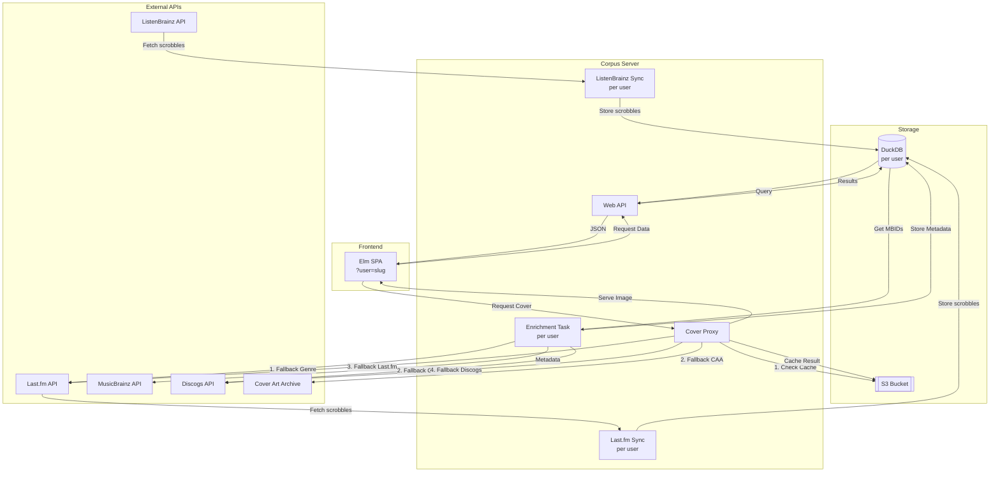

# Corpus Architecture

Corpus is a self-hosted music listening history dashboard and analytics service. It supports multiple users, synchronizing scrobbles from ListenBrainz and Last.fm and providing a performant web interface for data exploration and statistics.

## System Components

### Web Server
The server is built with PureScript running on Node.js. It handles several core responsibilities:
- **HTTP API**: Serves the frontend, scrobble data (with filtering/pagination), statistics, and similar tracks (via [cosine.club](https://cosine.club)). It also provides a **ListenBrainz-compatible scrobble submission endpoint**.
- **ListenBrainz Sync**: A background process that polls the ListenBrainz API every 60 seconds to fetch new scrobbles.
- **Last.fm Sync**: A background process that polls the Last.fm API every 60 seconds to fetch new scrobbles. Both syncs write to the same `scrobbles` table; duplicate timestamps are silently ignored.
- **Metadata Enrichment**: A background process that identifies scrobbles with missing metadata (genres, labels, release years) and fetches information from MusicBrainz, Last.fm, and Discogs.
- **Cover Art Proxy**: A specialized endpoint that fetches, caches, and serves cover art, utilizing a multi-source fallback strategy (CAA → Last.fm → Discogs).
- **Observability**: Prometheus metrics exposed at `/metrics`.

### Frontend
A Single Page Application (SPA) built with [Elm](https://elm-lang.org).
- **Real-time Updates**: Periodically refreshes the scrobble list.
- **Filtering & Search**: Supports deep filtering by genre, label, or release year.
- **Search Functionality**: Global search across tracks, artists, albums, and labels with real-time results.
- **About Page**: Provides system information, feature list, and links to related resources.
- **Clickable Metadata**: Track name, artist, album, and label in listen entries are all clickable for quick filtering.
- **Responsive UI**: Designed for both desktop and mobile viewing with a "retro-modern" aesthetic.

### Database
Corpus uses **DuckDB** for its primary data storage. Each user has their own database file.
- **Schema**:
    - `scrobbles`: Stores the core listening history (timestamp, track, artist, album, MBIDs). The `listened_at` Unix timestamp is the primary key — scrobbles from ListenBrainz and Last.fm deduplicate naturally.
    - `release_metadata`: Stores enriched metadata indexed by MusicBrainz Release ID (MBID), including genre, label, and release year.
    - `api_tokens`: Stores hashed user API tokens for scrobble submission. Tokens are hashed with SHA-256 before storage.
- **Performance**: DuckDB's columnar storage allows for extremely fast analytical queries across large listening histories.

### Storage
Uses an S3-compatible bucket to cache cover art images.
- **Caching Strategy**: Images are fetched once from external APIs and stored in S3 to reduce latency and avoid rate-limiting on external services.

## Multi-User Support

Corpus runs as a single server process serving multiple users. User configuration is defined in `users.json`, managed via the built-in CLI commands.

### Routing
- `/` and `/u/<slug>` — serve the Elm SPA for the root user and named users respectively
- `/proxy?user=<slug>`, `/stats?user=<slug>`, `/cover?user=<slug>` — shared API endpoints, user selected via query parameter
- `/healthz?user=<slug>` — liveness check; pings the user's DuckDB connection
- `/1/submit-listens` — ListenBrainz-compatible scrobble submission endpoint (requires `Authorization: Token <token>` header)
- `/metrics` — Prometheus metrics (no user parameter; covers all users; only available when `METRICS_ENABLED=true`)

### User Management

Users are managed via built-in CLI commands. The server must not be running when modifying `users.json`.

```sh
# Add a new user (creates the DB, prints the API token once)
node server.js add-user --slug filip --name "Filip" --db filip.db

# Optional: link a ListenBrainz or Last.fm account at creation time
node server.js add-user --slug filip --name "Filip" --db filip.db \
  --listenbrainz-user filip --lastfm-user filiplfm

# List all users
node server.js list-users

# Regenerate the API token for a user
node server.js reset-token --slug filip
```

The API token is only printed once on creation or reset — store it securely. It is used for the `/1/submit-listens` endpoint via `Authorization: Token <token>`.

### Configuration
User configuration is split into two layers:

1. **`users.json`** (non-sensitive): defines user slugs, source usernames, database filenames, and feature flags. Managed via CLI (`add-user`, `reset-token`, `list-users`). The server reads this file at startup from the path in `CORPUS_USERS_FILE` (defaults to `users.json`).

2. **Environment variables** (runtime, sensitive): shared API keys and S3 credentials are read from the environment at startup and applied to all users.

Each user gets their own `UserContext` with an independent DuckDB connection, sync loop, and write lock (`AVar Unit`). The write lock serializes all sync transactions — if a user has both ListenBrainz and Last.fm configured, their transactions are queued rather than run concurrently. HTTP reads do not acquire the lock; DuckDB's MVCC provides consistent snapshots.

### Graceful Shutdown

The server implements graceful shutdown handling to ensure clean termination of all background processes. When the server receives a shutdown signal, it:

1. **Kills background fibers**: Terminates all running background tasks (metadata enrichment, database backups) for each user
2. **Closes database connections**: Properly closes all DuckDB connections
3. **Logs cleanup progress**: Provides detailed logging during the shutdown process

This prevents data corruption and ensures that any in-progress operations are completed or safely aborted before the server exits.

## Configuration Reference

### Environment Variables

| Variable | Default | Purpose |
|---|---|---|
| `CORPUS_USERS_FILE` | `users.json` | Path to the compiled users config |
| `DATABASE_PATH` | _(cwd)_ | Root directory for all user database files |
| `LASTFM_API_KEY` | — | Last.fm API key (required if any user has `lastfmUser`) |
| `DISCOGS_TOKEN` | — | Discogs token for cover/genre fallback |
| `S3_BUCKET` | — | S3 bucket for cover art cache |
| `S3_REGION` | `us-east-1` | S3 region |
| `AWS_ACCESS_KEY_ID` | — | S3 credentials |
| `AWS_SECRET_ACCESS_KEY` | — | S3 credentials |
| `AWS_ENDPOINT_URL` | — | S3 endpoint (for S3-compatible storage) |
| `AWS_S3_ADDRESSING_STYLE` | — | `virtual` or `path` |
| `COSINE_API_KEY` | — | [cosine.club](https://cosine.club) API key for similar tracks |
| `PORT` | `8000` | HTTP listen port |
| `METRICS_ENABLED` | `false` | Set to `true` to enable the Prometheus `/metrics` endpoint |

### users.json Fields

| Field | Type | Purpose |
|---|---|---|
| `slug` | `Text` | URL slug (`""` for root user, `"filip"` for `/u/filip`) |
| `name` | `Optional Text` | Display name for the user (defaults to slug if not provided) |
| `listenbrainzUser` | `Optional Text` | ListenBrainz username |
| `lastfmUser` | `Optional Text` | Last.fm username |
| `databaseFile` | `Text` | DuckDB filename (relative to `DATABASE_PATH`) |
| `coverCacheEnabled` | `Bool` | Enable S3 cover art caching |
| `backupEnabled` | `Bool` | Enable periodic S3 database backups |
| `backupIntervalHours` | `Natural` | Backup frequency |

## Data Flow

### Scrobble Synchronization

Both sync processes follow the same pattern: fetch the most recent page, insert any new scrobbles, and paginate backwards through history until an already-known timestamp is encountered.

**ListenBrainz** (timestamp-based pagination):
1. Fetch latest 100 scrobbles from the ListenBrainz API.
2. Insert new scrobbles; stop if an existing timestamp is found.
3. Paginate backwards using `max_ts` until fully caught up.

**Last.fm** (page-based pagination):
1. Fetch page 1 (most recent 200 scrobbles) from the Last.fm API.
2. Insert new scrobbles; stop if an existing timestamp is found.
3. Paginate through subsequent pages using `totalPages` from the API response until fully caught up.

Both processes run every 60 seconds per user. On subsequent syncs they stop at the first known timestamp, making incremental updates efficient.

### Metadata Enrichment
1. Background task identifies MBIDs in `scrobbles` that are not in `release_metadata`.
2. Queries MusicBrainz API for release details.
3. If MusicBrainz lacks genre information, falls back to Last.fm and Discogs APIs.
4. Updates `release_metadata` with found information.

### Cover Art Retrieval
When a cover is requested:
1. Check S3 cache.
2. If not found:
    - Try **Cover Art Archive (CAA)** using the Release MBID.
    - Fallback to **Last.fm** using Artist/Album name.
    - Final fallback to **Discogs** search API.
3. If found in any source, the image is proxied to the client and uploaded to S3 in the background.

## Observability

### Prometheus Metrics

Prometheus metrics are **disabled by default**. Set `METRICS_ENABLED=true` to enable them. When enabled, all HTTP requests are instrumented via `Metrics.wrapRequest` and background work is tracked with dedicated counters and gauges. When disabled, the `/metrics` endpoint returns 404 and all metric-increment calls are no-ops with no runtime overhead.

| Metric | Type | Labels | Description |
|---|---|---|---|
| `corpus_http_requests_total` | Counter | `method`, `path`, `status` | HTTP requests |
| `corpus_http_request_duration_seconds` | Histogram | `method`, `path` | HTTP request latency |
| `corpus_sync_runs_total` | Counter | `user`, `source`, `result` | Sync loop iterations |
| `corpus_sync_scrobbles_added_total` | Counter | `user`, `source` | Scrobbles inserted per sync |
| `corpus_sync_last_success_seconds` | Gauge | `user`, `source` | Timestamp of last successful sync |
| `corpus_enrichment_fetches_total` | Counter | `user`, `source`, `result` | Metadata enrichment API calls |
| `corpus_enrichment_queue_size` | Gauge | `user`, `type` | Releases pending enrichment |
| `corpus_cover_requests_total` | Counter | `user`, `source`, `result` | Cover art requests |
| `corpus_db_backup_runs_total` | Counter | `user`, `result` | Database backup runs |
| `corpus_db_backup_last_success_seconds` | Gauge | `user` | Timestamp of last successful backup |

Node.js default metrics (GC, event loop, memory) are also collected via `prom-client`'s `collectDefaultMetrics`.

## Tech Stack

- **Language**: [PureScript](https://purescript.org) (server), [Elm](https://elm-lang.org) (frontend)
- **Runtime**: [Node.js](https://nodejs.org)
- **Database**: [DuckDB](https://duckdb.org) (one file per user)
- **Config**: JSON (`users.json`, managed via CLI)
- **Bundling**: [spago](https://github.com/purescript/spago) + [esbuild](https://esbuild.github.io/) (server), [elm make](https://guide.elm-lang.org/install/elm.html) (frontend)
- **Environment**: [Nix](https://nixos.org) for reproducible development shells and container builds

## Foreign Function Interface (FFI)

Corpus relies on FFI to interact with the Node.js ecosystem where native PureScript wrappers are unavailable. Key FFI integrations:

- **Database (`Db.js`)**: Interface to the native `duckdb` library. Includes BigInt → Number conversion for JSON compatibility.
- **Cloud Storage (`S3.js`)**: AWS SDK (`@aws-sdk/client-s3`) for cover art caching. Takes explicit config structs rather than reading `process.env`.
- **System Utilities (`Main.js`)**: Bridges PureScript with Node.js — `dotenv` loading and request helpers.
- **Config (`Config.js`)**: Reads and parses `users.json` from the path given by `CORPUS_USERS_FILE`.
- **Observability (`Metrics.js`)**: Initialises `prom-client` (Prometheus). Exports metric-increment helpers called from PureScript and the `wrapRequest` function that records metrics and logs each HTTP request.

## System Flow


